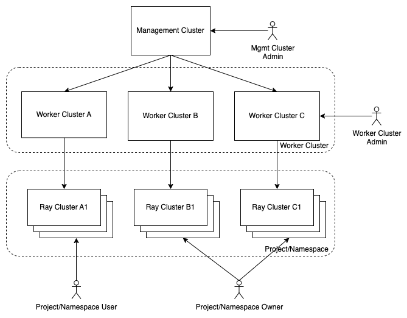

# Multi-cluster Management of 1Block.AI

## Summary

This is an enhancement proposal for 1Block.AI multi-cluster feature(OMF). OMFs describe the high-level design of the oneblock multi-cluster management feature. The goal of this documentation is to provide a consistent structure for OMFs so that readers can easily understand the state of the project and the next steps.

### Related Issues

https://github.com/oneblock-ai/oneblock/issues/7

## Motivation

1Block.AI aims to provide a unified platform for AI/ML fine-tuning & deployment with multi-cluster & multi-tenancy support. With [Kubernetes Cluster API](https://cluster-api.sigs.k8s.io/), it can provide a way to allow users to create and manage multiple worker clusters for their ML projects using different cloud providers or on-premise servers.

Within a worker cluster, a worker cluster admin can create and manage multiple RayClusters, in this way, it can maximize the resource utilization(e.g., GPU) of the worker cluster.

### Goals

- Provide a feature gate to enable/disable the multi-cluster feature on the management cluster.
- To work in different environments, both on-premises and in the cloud.
- Allow cluster admins to manage the lifecycle (create, scale, upgrade, destroy) of worker(kubernetes-conformance) clusters using a declarative API/UI.
    - Built-in integration with k3s provisioner.
- Allow worker cluster admins to manage the lifecycle (create, scale, upgrade, destroy) of RayClusters using a declarative API/UI.
    - Built-in integration with KubeRay and default RayCluster.
- Allow project/namespace user to create and manage RayJobs on the RayCluster.

### Non-goals

- Provide required infrastructure set up for the ML projects.
- Provide hardware management of the worker cluster.

## Proposal

1Block.AI platform is a multi-cluster & multi-tenant platform for AI/ML training & deployment. It has a management cluster and multiple worker clusters. The management cluster is used to manage the worker clusters. The worker clusters are used to run RayClusters and RayJobs.

The management cluster is a kubernetes cluster with the following components:
- Oneblock api-server
- Cluster API
- Cluster API infrastructure providers(e.g., AWS)
- Cluster API bootstrap & control-plane providers(e.g., k3s)

A worker cluster is a kubernetes cluster(default to k3s) with the following components:
- KubeRay Operator
- A default RayCluster

A RayCluster is a set of worker nodes connected to a common Ray head node(pod scheduled on control-plane nodes). Ray clusters can be fixed-size, or they may auto-scale up and down according to the resources requested by applications running on the cluster.
- A RayCluster is managed by the worker cluster admin.
- A project/namespace user can only create and submit RayJob to the RayCluster.

TODO: 
- worker nodes on the worker cluster may auto-scale up and down according to the resources requested by RayClusters(privileged RayCluster) running on the cluster.
- support using spot-instance for the worker nodes on the worker cluster.
- support using machine pools for the worker cluster.

### User Stories
<!-- Detail the things that people will be able to do if this enhancement is implemented. A good practise is including a comparsion of what user cannot do before the enhancement implemented, why user would want an enhancement and what user need to do after, to make it clear why the enhancement beneficial to the user.
The experience details should be in the `User Experience In Detail` later.-->

#### Story 1

As a management cluster admin, I want to be able to enable the multi-cluster feature and select supported cloud providers, so that standard users can create a new worker cluster.

```yaml
FeatureGate:
  MultiClusterManagement: true
  SupportedCloudProviders:
  - aws
  - gcp
  - azure
  - vsphere
  SupportedProvisioners:
  - k3s
```

#### Story 2  
As a standard cluster user, I want to spin up a new worker cluster using the supported cloud provider(i.e., AWS) and provisioner(i.e., k3s).

```yaml
apiVersion: v1
kind: Secret
metadata:
 name: my-credentials
 namespace: default
 labels:
   cluster.x-k8s.io/provider: aws
type: Opaque
data:
 AWS_B64ENCODED_CREDENTIALS: ...
---
apiVersion: management.oneblock.ai/v1
kind: Cluster
metadata:
  name: aws
  namespace: default
spec:
  provider: 
    name: aws
    configSecret:
      name: my-credentials
  provisioner: 
    type: k3s
    k8sVersion: v1.28.4
```

#### Story 3

As a cluster admin, I want to 

```yaml
```

### User Experience In Detail

Detail what user need to do to use this enhancement. Include as much detail as possible so that people can understand the "how" of the system. The goal here is to make this feel real for users without getting bogged down.

### API changes

## Design

The follow diagram shows the high-level design of the oneblock multi-cluster management feature.
[](./assets/oneblock-ai-multi-cluster-management.png)

### Implementation Overview

CAEP uses [Kubernetes Cluster API](https://cluster-api.sigs.k8s.io/introduction) to provision Kubernetes clusters on AWS, GCP, Azure, and vSphere. The Cluster API is a Kubernetes project to bring declarative, Kubernetes-style APIs to cluster creation, configuration, and management. It provides optional, additive functionality on top of core Kubernetes.

https://github.com/kubernetes-sigs/cluster-api-operator/blob/main/docs/README.md#installation

### Test plan

Integration test plan.

### Upgrade strategy

Anything that requires if user want to upgrade to this enhancement

## Note [optional]

Additional nodes.
